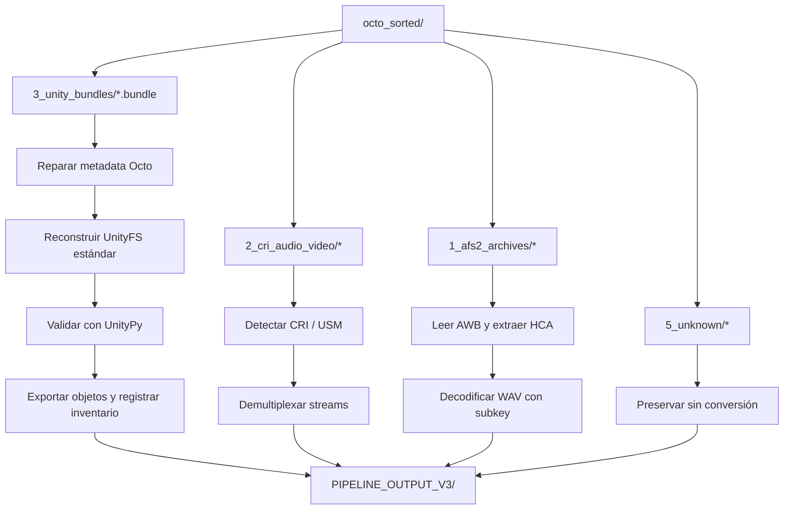
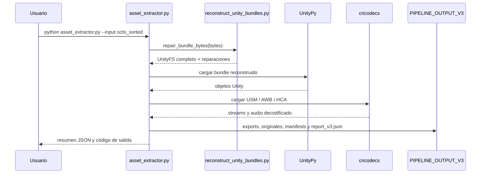
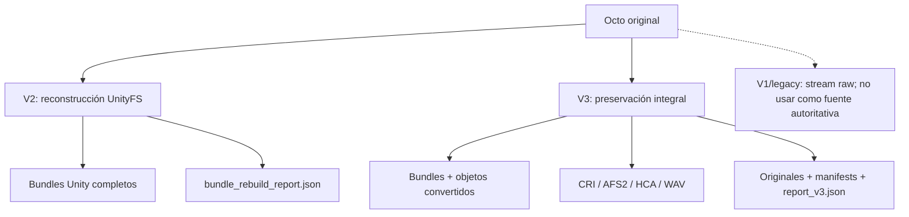

# Kick Flight — Octo Asset Preservation Pipeline

Pipeline de preservación y extracción para los recursos locales de **Kick Flight** almacenados en la distribución/cache **Octo**. Reconstruye bundles UnityFS, exporta objetos legibles para investigación y conserva los bytes originales para que ningún resultado convertido sustituya a la fuente.

> Uso responsable: trabaja únicamente con copias de archivos que tengas derecho a analizar. Este repositorio procesa contenido local; no implementa autenticación, matchmaking, lógica de batalla, acceso a cuentas ni protocolos del servidor de Grenge.

## Resumen ejecutivo

El entrypoint actual es [asset_extractor.py](asset_extractor.py). Con un solo comando recorre octo_sorted/ y genera:

- bundles UnityFS completos y cargables por UnityPy;
- objetos Unity convertidos a PNG, OBJ, JSON, shaders, fuentes y bytes crudos;
- AnimationClip en JSON más su serialización exacta en .bin;
- streams CRI USM demultiplexados;
- entradas AFS2/AWB en su formato codificado y audio HCA convertido a WAV;
- copias byte a byte de archivos CRI y desconocidos;
- inventarios, hashes SHA-256, reparaciones, advertencias, errores y un reporte agregado.

Los bundles de 1_complete_unityfs/ son la salida autoritativa. Los archivos convertidos son vistas de trabajo para inspección, búsqueda, edición o importación; no reemplazan el bundle original.

## Flujo completo



### Qué ocurre con un bundle Unity

```mermaid
flowchart LR
    A["Bytes Octo"] --> B["XOR sobre la firma"]
    B --> C["Comprobar UnityFS v6"]
    C --> D["Descomprimir blocks-info con LZ4"]
    D --> E["Probar conteos y complementos válidos"]
    E --> F["Reparar tamaños, flags y nodos"]
    F --> G["Escribir cabecera UnityFS de 50 bytes"]
    G --> H["Conservar payload y nodos CAB/.resS"]
    H --> I["UnityPy.load()"]
    I --> J["Exports + manifests"]
```



### Secuencia de una ejecución V3



## Datos de entrada: octo_sorted/

El snapshot incluido contiene el inventario registrado en [octo_sorted/extraction_report.json](octo_sorted/extraction_report.json):

| Carpeta | Contenido observado | Cantidad | ¿La consume V3? |
| --- | --- | ---: | --- |
| 1_afs2_archives/ | Contenedores AFS2/AWB con entradas de audio | 12 | Sí |
| 2_cri_audio_video/ | Archivos CRI; el detector identifica el formato real | 148 | Sí |
| 3_unity_bundles/ | Bundles UnityFS con formato Octo | 2374 | Sí |
| 4_unity_fixed/ | Archivos Unity ya reparados de una etapa anterior | 644 | No, queda como referencia manual |
| 5_unknown/ | Archivos que no se clasificaron | 46 | Sí, se preservan sin conversión |

La cantidad es propia de este snapshot y puede cambiar si se reemplaza el dump. El pipeline principal busca los bundles directamente en 3_unity_bundles/*.bundle; no hace una búsqueda recursiva ni usa automáticamente 4_unity_fixed/.

## Requisitos

- Python **3.10 o superior**. El código usa anotaciones y sintaxis moderna de Python; 
- Espacio suficiente para bundles completos, conversiones y copias preservadas. El procesamiento puede generar muchos archivos.
- Dependencias de [requirements.txt](requirements.txt):

  - lz4 para blocks-info y bloques Unity comprimidos;
  - UnityPy para leer e inventariar objetos Unity;
  - cricodecs para CRI USM, AFS2/AWB, HCA y WAV.

El entorno local con el que se verificó este README usa Python 3.14.5, lz4 4.4.5 y UnityPy 1.25.3.

## Instalación

Desde la raíz del repositorio:

### Windows PowerShell

```powershell
python --version
python -m venv .venv
.\.venv\Scripts\Activate.ps1
python -m pip install --upgrade pip
python -m pip install -r requirements.txt
```

Si PowerShell bloquea la activación, puede usarse el intérprete del entorno directamente:

```powershell
.\.venv\Scripts\python.exe -m pip install -r requirements.txt
.\.venv\Scripts\python.exe asset_extractor.py
```

### Git Bash o Linux/macOS

```bash
python3 --version
python3 -m venv .venv
source .venv/bin/activate
python -m pip install --upgrade pip
python -m pip install -r requirements.txt
```

## Ejecución recomendada: pipeline V3 completo

Con el entorno virtual activo y situándose en la raíz del proyecto:

```bash
python asset_extractor.py --input octo_sorted --output PIPELINE_OUTPUT_V3
```

Los valores anteriores coinciden con los defaults del código, por lo que también funciona:

```bash
python asset_extractor.py
```

Para una prueba corta, --limit N toma los primeros N elementos de **cada categoría** de entrada, no N elementos totales:

```bash
python asset_extractor.py --input octo_sorted --output PIPELINE_OUTPUT_V3_SMOKE --limit 1
```

Opciones disponibles:

| Opción | Default | Descripción |
| --- | --- | --- |
| --input PATH | octo_sorted | Raíz con las cinco carpetas clasificadas |
| --output PATH | PIPELINE_OUTPUT_V3 | Directorio donde se escribe todo el resultado |
| --limit N | sin límite | Procesa los primeros N archivos por categoría |

El proceso continúa con los demás archivos aunque encuentre un fallo. Al terminar:

- código de salida 0: no hubo errores registrados;
- código de salida 1: hubo uno o más errores; revisar manifests/errors.json;
- las advertencias no hacen fallar la ejecución, pero quedan en manifests/warnings.json.

## Reconstrucción especializada de UnityFS

[reconstruct_unity_bundles.py](reconstruct_unity_bundles.py) es el módulo de bajo nivel para reparar únicamente los bundles Unity de octo_sorted/3_unity_bundles/. asset_extractor.py ya usa esta misma lógica internamente, así que no es necesario ejecutar ambos para obtener la salida V3.

Ejecución completa de la etapa especializada:

```bash
python reconstruct_unity_bundles.py
```

Ejecución de prueba y ejecución rápida sin validación UnityPy:

```bash
python reconstruct_unity_bundles.py --limit 10
python reconstruct_unity_bundles.py --no-verify
```

Con rutas explícitas:

```bash
python reconstruct_unity_bundles.py \
  --input octo_sorted/3_unity_bundles \
  --output PIPELINE_OUTPUT_V2/1_reconstructed_bundles
```

Esta herramienta:

1. comprueba la firma XOR y exige UnityFS format 6;
2. descomprime la metadata LZ4;
3. reconstruye la tabla de bloques y el directorio de nodos;
4. conserva nodos CAB-*, .resS y otros sidecars;
5. verifica cada salida con UnityPy salvo que se pase --no-verify;
6. escribe PIPELINE_OUTPUT_V2/bundle_rebuild_report.json con tamaños, hashes, nodos, reparaciones, objetos y errores.

## Estructura de salida V3

```text
PIPELINE_OUTPUT_V3/
├── 1_complete_unityfs/
│   └── *.bundle                         # bundles UnityFS completos y reparados
├── 2_converted_unity_assets/
│   ├── images/
│   │   ├── Texture2D/                   # PNG
│   │   ├── Sprite/                      # PNG
│   │   └── Cubemap/                     # PNG cuando UnityPy puede convertirlo
│   ├── meshes/                          # OBJ
│   ├── structured/                      # JSON por tipo Unity
│   ├── animation_raw/                   # bytes exactos de AnimationClip
│   ├── structured_raw/                  # bytes de tipos estructurados
│   ├── text_assets/                     # TextAsset como bytes originales
│   ├── shaders/                         # shaders exportados
│   ├── fonts/                           # datos de fuentes
│   └── unconverted_raw/                 # fallback ante conversión incompleta
├── 3_cri_media/
│   ├── usm_demux/                       # streams extraídos de USM
│   └── awb_entries/                     # HCA y WAV por entrada AWB
├── 4_preserved_originals/
│   ├── cri_loose/                       # copias de CRI sueltos
│   ├── afs2_awb/                        # copias de AFS2 originales
│   └── unknown/                         # copias de archivos desconocidos
├── manifests/
│   ├── unity_objects.jsonl              # un registro por objeto Unity
│   ├── bundles.json                     # bundles, nodos, hashes y reparaciones
│   ├── animations.json                  # índice de AnimationClip
│   ├── media.json                       # índice de CRI y AFS2/AWB
│   ├── errors.json                      # errores por etapa y archivo
│   └── warnings.json                    # conversiones con fallback o warning
└── report_v3.json                       # resumen agregado
```

### Exportaciones por tipo

| Tipo detectado | Salida principal | Preservación adicional |
| --- | --- | --- |
| Texture2D, Sprite, Cubemap | PNG | .bin si las dimensiones son inválidas |
| Mesh | OBJ | fallback .bin si falla la conversión |
| Material, AnimatorController, AnimatorOverrideController, Avatar, MonoBehaviour | JSON de typetree | bytes serializados cuando aplica |
| AnimationClip | JSON de typetree | .bin exacto e índice animations.json |
| TextAsset | .bin | se restaura el byte original mediante surrogateescape |
| Shader | .shader | fallback .bin si UnityPy no lo exporta |
| Font | .font | bytes de m_FontData |
| USM | streams demultiplexados | copia original en 4_preserved_originals/cri_loose/ |
| AWB/HCA | HCA codificado y WAV | copia original del AFS2 |
| Desconocido | — | copia byte a byte |

## Hallazgos: cifrado y ofuscación de Octo

### 1. XOR repetitivo de 7 bytes

La firma inicial de los bundles no aparece como UnityFS en bruto. La implementación aplica una clave XOR repetitiva a los primeros siete bytes:

```text
6F 0F FA 46 D3 28 3A
```

Para cada posición i:

```text
decoded[i] = raw[i] XOR key[i mod 7]
```

En el sample incluido, esa operación produce exactamente 55 6E 69 74 79 46 53, es decir, UnityFS.

Esto es ofuscación reversible, no cifrado criptográfico robusto: la clave es corta, repetitiva y está embebida en el código. No hay evidencia en estos scripts de AES, RSA, intercambio de claves, keystore o una capa criptográfica general para el payload.

### 2. Cabecera Octo distinta de la cabecera UnityFS estándar

Después de la firma, el prefijo almacenado por Octo no se puede pasar directamente a UnityPy. El reconstruidor:

- recupera el formato UnityFS 6;
- toma la información de versión/revisión del encabezado de entrada;
- reconstruye una cabecera UnityFS estándar de 50 bytes;
- establece flags 0x00000003, que indican blocks-info LZ4;
- recalcula el tamaño total con la metadata comprimida reconstruida y el payload original.

El payload de datos no se vuelve a cifrar ni se reinterpreta como un formato nuevo; se conserva y se vuelve a asociar con su directorio de nodos.

### 3. Metadata parcialmente dañada u ofuscada

La reparación no confía ciegamente en los contadores del archivo. Evalúa candidatos y acepta únicamente una estructura consistente:

- el block_count original o una variante con un byte complementado, byte XOR 0xFF;
- node_count con la misma estrategia de candidato;
- flags de bloque dentro de {0, 1, 2, 3};
- flags de nodo dentro de {0, 1, 2, 4};
- suma de tamaños comprimidos igual al tamaño real del payload;
- nodos contiguos, comenzando en offset 0 y terminando en el tamaño total sin comprimir;
- nombres de nodo UTF-8 y consumo exacto de blocks-info.

Cuando el bloque de información LZ4 falla, también se prueba una reparación puntual del byte 5 de esa sección. Cada cambio queda registrado en repairs y en manifests/bundles.json o bundle_rebuild_report.json.

La consecuencia importante es que block_count no es una fuente de verdad suficiente. La estructura completa —tamaños, flags, offsets, nombres y tamaño del payload— funciona como comprobación de integridad y evita adivinar cuando hay más de una solución posible.

### 4. Sidecars Unity y por qué importa el directorio de nodos

Un bundle UnityFS no es solamente la concatenación de bloques descomprimidos. Su directorio relaciona el archivo serializado con recursos externos como CAB-* y .resS. La etapa antigua de extracción podía producir un stream útil, pero perdía esa relación.

La reconstrucción actual conserva el directorio completo. Por eso los bundles de 1_complete_unityfs/ son mejores candidatos para abrirse con UnityPy o investigarse con un cliente compatible que los streams crudos de etapas anteriores.

### 5. HCA no es la misma capa que XOR de Octo

El audio HCA se encuentra dentro de entradas AWB. cricodecs lee el subkey del contenedor AWB y lo usa al decodificar a WAV. Esa protección/decodificación pertenece al formato de audio CRI y debe analizarse por separado de la ofuscación XOR y metadata de los bundles Octo.

## Diferencia entre las etapas y qué conserva cada una



| Etapa | Entry point | Uso principal | Salida |
| --- | --- | --- | --- |
| V3 | asset_extractor.py | Resultado integral en una sola ejecución | PIPELINE_OUTPUT_V3/ |
| V2 | reconstruct_unity_bundles.py | Diagnóstico/reconstrucción UnityFS dedicada | PIPELINE_OUTPUT_V2/ |
| Legacy | scripts o outputs históricos | Compatibilidad con investigaciones previas | No usar como fuente de verdad |

## Verificación rápida

La forma más representativa de comprobar instalación, reparación, UnityPy y CRI sin procesar todo el dump es:

```bash
python asset_extractor.py --input octo_sorted --output PIPELINE_OUTPUT_V3_SMOKE --limit 1
```

Una ejecución correcta debe crear PIPELINE_OUTPUT_V3_SMOKE/report_v3.json y dejar errors igual a 0. En el snapshot local, la prueba de un elemento reconstruyó un bundle, cargó objetos Unity, demultiplexó un USM y produjo WAV desde una entrada HCA.

También puede verificarse solo UnityFS:

```bash
python reconstruct_unity_bundles.py \
  --input octo_sorted/3_unity_bundles \
  --output PIPELINE_OUTPUT_V2_SMOKE/1_reconstructed_bundles \
  --limit 1
```

### Suite de pruebas

Las pruebas requieren pytest, que no forma parte de requirements.txt:

```bash
python -m pip install pytest
python -m pytest -q
```

Las pruebas de pipeline importan V3Pipeline desde asset_extractor.py; la prueba de reconstrucción usa directamente reconstruct_unity_bundles.py.

## Troubleshooting

### ModuleNotFoundError: lz4, UnityPy o cricodecs

Comprueba que el entorno virtual está activo e instala las dependencias con el mismo intérprete que ejecutará el pipeline:

```bash
python -m pip install -r requirements.txt
python -c "import lz4, UnityPy, cricodecs; print('dependencias OK')"
```

### no .bundle files found

El reconstruidor especializado espera octo_sorted/3_unity_bundles/*.bundle. Revisa la ruta y que estés ejecutando desde la raíz del repositorio, o pasa --input explícitamente.

### Hay archivos en errors.json

El batch continúa por diseño. Busca el campo stage para distinguir unity_bundle, cri_loose, afs2_awb, unity_typetree o una conversión individual. El archivo original de entrada no se modifica; la salida problemática queda registrada.

### Hay un .bin en unconverted_raw/

No significa necesariamente pérdida de datos. Es el fallback de preservación cuando UnityPy no puede convertir un objeto, una imagen tiene dimensiones inválidas o un typetree no se puede leer. Usa unity_objects.jsonl para localizar el bundle, path_id, tipo y nombre.

### El proceso tarda o consume mucho espacio

Empieza con --limit 1 o --limit 10, usa un --output temporal y confirma el resultado antes de lanzar la ejecución completa. --no-verify acelera únicamente la herramienta especializada V2; no desactiva las reparaciones.

### El archivo convertido no es suficiente para reconstruir un cliente

Usa 1_complete_unityfs/ y los originales preservados. Un PNG, OBJ o JSON es una representación de investigación y puede perder información específica de Unity; el bundle completo y los .bin serializados son la referencia primaria.

## Convenciones y reproducibilidad

- Las salidas se organizan por bundle, archivo de assets y path_id para evitar colisiones de nombres.
- Los nombres legibles se sanitizan para impedir separadores de ruta y metacaracteres.
- Los manifests registran hashes SHA-256 de los bundles reconstruidos y de los medios preservados.
- unity_objects.jsonl usa un registro JSON por línea, adecuado para búsquedas incrementales sin cargar todo en memoria.
- Los reportes se escriben en UTF-8 y conservan bytes no UTF-8 mediante Base64 o surrogateescape según el tipo de objeto.
- PIPELINE_OUTPUT_V3/ está ignorado por Git. Conviene usar un directorio de salida separado para no mezclar resultados nuevos con artefactos legacy.

## Alcance y límites

Este proyecto es una herramienta de análisis y preservación de contenido. No:

- reconstruye el backend, catálogo Octo, cuentas, autenticación o matchmaking;
- emula la simulación de batalla ni crea un servidor de Kick Flight;
- repaqueta automáticamente un APK o genera un proyecto Unity listo para compilar;
- garantiza que todos los objetos Unity tengan una conversión de alta fidelidad;
- interpreta semánticamente cada MonoBehaviour o asset desconocido.

El objetivo es conservar la evidencia original, producir representaciones útiles y dejar trazabilidad suficiente para continuar la investigación de forma reproducible.

## Créditos técnicos

- **Proyecto:** Kick Flight Asset Extractor
- **Target Unity observado:** 2018.4.11f1
- **Formato de bundle:** UnityFS format 6
- **Compresión:** LZ4 para blocks-info y bloques Unity según metadata
- **Media:** CRI USM, AFS2/AWB, HCA y WAV mediante cricodecs
- **Parser Unity:** UnityPy
- **Autor original indicado en el proyecto:** Gixarde3
